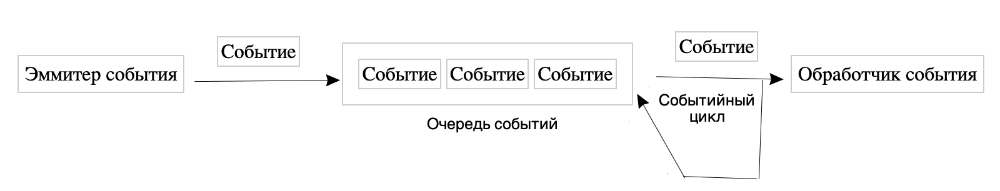

# События в JavaScript

Разберем как работают события в **js**:

Допустим пользователь нажал на кнопку, кнопка сгенерировала событие. Кнопка в данном случае будет называться и **эммитером** события. После чего событие помещается в очередь событий (**event queue**), события, сгенерированные первыми и обрабатываются в первую очередь. Цикл событий (**event loop**) постоянно проверяет, есть ли в оечереди события, если есть, **event loop** посылает его к обработчику событий (**event handler**). **Event handler** представлен как простая функции, и под каждое событие выделена своя функция. Выделим основные термины:
+ **эммитер**: тригер создания события
+ **event queue**:  очередь событий
+ **event loop**: цикл события, проверит наличие их в очереди и посылает их к обработчику
+ **event handler**: обработчик события, в виде простой функции. 

#### В JavaScript есть следующие типы событий
+ События мыши(перемещение курсора, нажатия мыши)
+ События клавиатуры(нажатие клавиш клавиатуры)
+ События жизненного цикла элементов(событие загрузки страницы)
+ Собфтия элементов форм(надатия кнопок, выбор элементов в выпадающем списке)

И.т.д.  

### Базовые события
по ссылке:

#### https://metanit.com/web/javascript/9.1.php