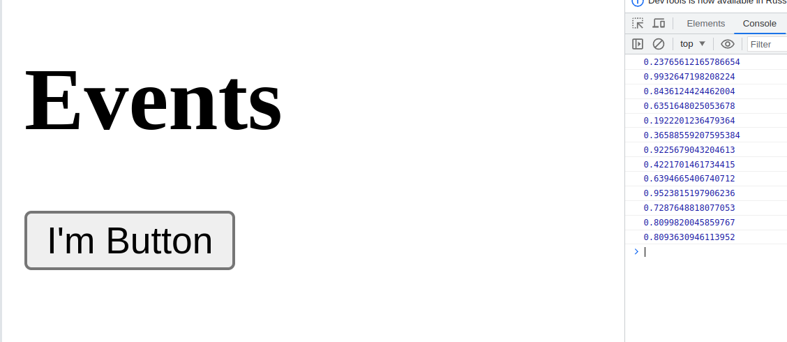

# События в JavaScript

Разберем как работают события в **js**:

Допустим пользователь нажал на кнопку, кнопка сгенерировала событие. Кнопка в данном случае будет называться и **эммитером** события. После чего событие помещается в очередь событий (**event queue**), события, сгенерированные первыми и обрабатываются в первую очередь. Цикл событий (**event loop**) постоянно проверяет, есть ли в оечереди события, если есть, **event loop** посылает его к обработчику событий (**event handler**). **Event handler** представлен как простая функции, и под каждое событие выделена своя функция. Выделим основные термины:
+ **эммитер**: тригер создания события
+ **event queue**:  очередь событий
+ **event loop**: цикл события, проверит наличие их в очереди и посылает их к обработчику
+ **event handler**: обработчик события, в виде простой функции. 


#### В JavaScript есть следующие типы событий
+ События мыши(перемещение курсора, нажатия мыши)
+ События клавиатуры(нажатие клавиш клавиатуры)
+ События жизненного цикла элементов(событие загрузки страницы)
+ Собфтия элементов форм(надатия кнопок, выбор элементов в выпадающем списке)

И.т.д.  

### Базовые события
по ссылке:

#### https://metanit.com/web/javascript/9.1.php

# Обработчики событий 

Иммеем следующий `body` в **html-документе**:
```html
<body>
    <h1>Events</h1>
    <button id="button1">I'm Button</button>
</body>
```
Чтобы добавить кнопке событие, создадим файл **.js**, напишем в нем функцию, которая, предполагается, будет обрабатывать нажатие нашей кнопки `button1`. При нажатии будет выводить в консоль рандомное число. Код **.js** файла выглядит следующим образом:
```js
function button1_Click()
{
    console.log(Math.random());
}
``` 
Найдем тег этой кнопки по **id** - `button1` и назначим его событию `onclick` функцию `button1_Click`, написаную нами ранее:
```js
let button1 = document.getElementById("button1");
button1.onclick = button1_Click;
```
Изменим **html-документ**:
```html
<body>
    <h1>Events</h1>
    <button id="button1">I'm Button</button>
    <script src="js/EventsHandler.js"></script>
</body>
```

Результат:



## Слушатели событий 

Для работы со слушателями в **JavaScript** есть объект `EventTarger`, который определяет методы `addEventListener`(добавление слушателя) и `removeEventListener`(удаление слушателя). Все **html-елементы** тоже являются объектами `EventTarget`, поэтому _они также реализуют выше перечисленные методы_.

Метод `addEventListener` принимает два параметра: название собатия без префикса **on**, который имеет все события(как я понял), и функцию обработчик этого события.

Например:
```js
let button = document.getElementById("button1");
button.addEventListener("click",button1_Click);
```

Главным плюссом слушателей, то что на одно событие мы можем назначить несколько обрабютчиков!