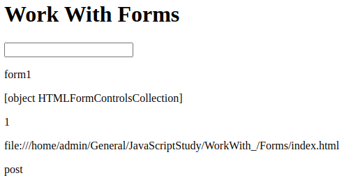
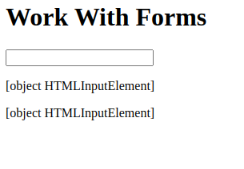
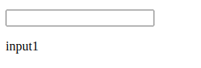
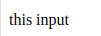
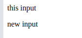
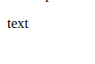
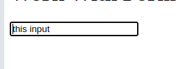
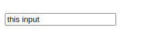

# Work with forms. js

Допустим у нас есть **html-документ**:
```html
<body>
    <h1>Work With Forms</h1>
    <form id="form1" name="form1" method="post" action="index.html">
        <input type="text" id="input1" name="input1" value="this input"/>

    </form>
    <script src="js/forms.js"></script>
</body>
```
Создадим папку `js` и поместим туда файл `forms.js` в котором будем работать с формой.

## Получение формы

+ Первый способ состоит в получении **коллекции** форм документа.

По имени:
```js
let forms = document.forms["form1"];
``` 
По индексу:
```js
let forms = document.forms[0];
```

+ Второй способ - использование стандартных методов поиска по **id** или **имени**.
По **id**:
```js
let form1 = document.getElementById("form1");
```
По **имени**:
```js
let form1 = document.getElementByName("form1");
```

### Методы и свойства форм 
**Свойства**:
+ `name`: имя формы
+ `elments`: коллекция элементов формы
+ `length`: количество элементов формы
+ `action`: значение атрубута **action** формы
+ `method`: значение атрибута **method** формы

`forms.js`:
```js
let formTag = document.getElementById("form1");

document.write("<p>",formTag.name,"</p>");
document.write("<p>",formTag.elements,"</p>");
document.write("<p>",formTag.length,"</p>");
document.write("<p>",formTag.action,"</p>");
document.write("<p>",formTag.method,"</p>")
```

Ответ страницы:



**Методы**:
+ `submit()`: отправляет данные формы на сервер
+ `reset()`: очищает поля формы

Создаем файл `executeFormMethods.js`:
```js
let formTag = document.getElementById("form1");

formTag.submit();
formTag.reset();
```

В нашем случае страница будет циклически запускать скрипт и результат мы не увидим.

### Элементы форм 

Форма **html-документа** содержит различные теги ввода(input, textarea, button, select итд). JavaScript имеет свой тип под каждый такой элемент:
+ `<input>`: HTMLInputElement
+ `<textarea>`: HTMLTextAreaElement
+ `<select>`: HTMLSelectElement
+ `<option>`в списках `<select>`: HTMLOptionElement

Для получения элементов форм стоит выделить:
+ Использовать свойство `elements` объекта формы :
  ```js
  let formTag = document.getElementById("form1");
    //в коллекции, начиная с 0
    let inputText = formTag.elements[0];
    document.write("<p>",inputText,"</p>");
    //в коллекции, по имени
    let inputText2 = formTag.elements["input1"];
    document.write("<p>",inputText2,"</p>");
  ```
  Рузультат страницы:

  

+ Использование имени формы и элемента:
  ```js
  document.write("<p>",document.form1.input1,"</p>")
  ```
  

### Свойства элементов форм

Из свойств можно выделить:
+ `name`:
  ```js
  const formTag = document.getElementById("form1");

    let input = formTag.elements["input1"]

    document.write("<p>",input.name,"</p>")
  ```
  Рузультат:

  
+ `value`:
  ```js
  document.write("<p>",input.value,"</p>");
  ```
  Результат:

  

  #### Установка значения поля
  ```js
  input.value = "new input";
    document.write("<p>",input.value,"</p>");
  ```
  Рузультат:

  

+`type`:
  ```js
  document.write("<p>",input.type,"</p>")
  ```
  Результат:

  

### Методы элементов форм 

+ `focus()`: устанавливает фокус на элемент
  ```js
  let input = form.elements["input1"];

    input.focus();
  ```
  Результат:

  
+ `blur()`: убирает фокус с элемента
  ```js
  input.blur();
  ```
  Результат:

  